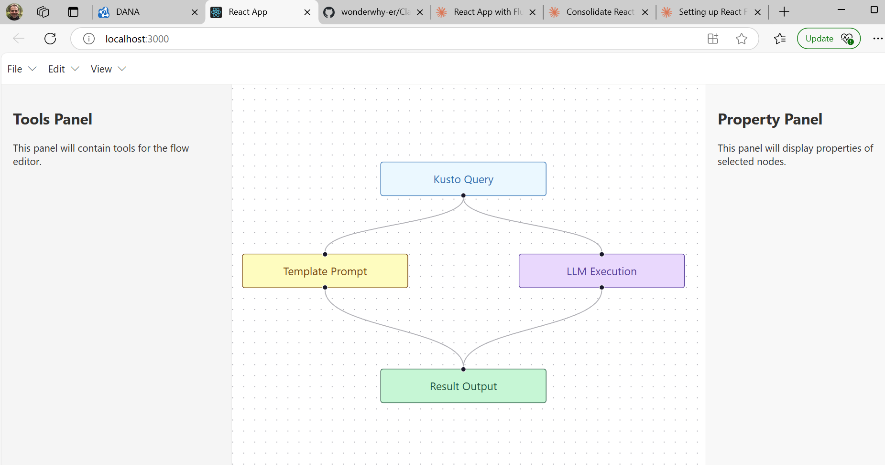

# React Flow Experiment

## Project Overview
This project is an experimental UI built using React Flow to create a basic workflow application. The application allows users to add flowchart elements to the UI and connect them to each other, creating visual representations of workflows.

*We're writing this application using AI Agents as a research
project.  This version was written by Claude 3.7 Sonnet using Claude Desktop and the [Desktop Commander MCP from wonderwhy-er](https://github.com/wonderwhy-er/ClaudeDesktopCommander/tree/main).  Details of exactly what we typed at every stage are recorded in [doc/history.md](doc/history.md)*.



## Purpose
The primary goal is to establish a framework for specifying automated workflows that involve:
- Kusto queries
- Templating prompts
- Executing LLM (Large Language Model) calls

## Features
- Drag-and-drop interface for placing workflow nodes
- Connection capabilities between nodes
- Visual representation of process flows
- Configuration options for each node type
- Uses Fluent UI components

## Target Functionality
The completed application will allow users to set up automated workflows for processing data through various stages, from querying databases to generating AI-powered responses.


## Getting Up to Speed
* Use this to start chats with agents. *

We're working on an application in C:\Users\rilack\code\react-flow-exp1
This is a React app using Fluent UI.  It's about allowing users to work with flowchart-style
nodes and edges using React Flow.  Ultimately we're allowing users to define workflows of operations
to perform in an AI application.  The nodes are things to do such as running Kusto queries, extracting
sub-parts out of JSON data, running LLM calls, and things of that nature.

Here's an (abbreviated) recent run of `git ls-files` to give you an idea of what's here:
```
.gitignore
README.md
package-lock.json
package.json
public/index.html
src/App.css
src/App.js
src/App.test.js
src/components/Flow.jsx
src/components/FlowPanel.jsx
src/components/FlowPanel.scss
src/components/PropertyPanel.jsx
src/components/Tools.jsx
src/components/index.js
src/index.css
src/index.js
src/logo.svg
src/reportWebVitals.js
src/setupTests.js
```
---


## Getting Started

### Install
```
npm install
```

### Running
```
npm start
```

This runs the app in development mode. Open [http://localhost:3000](http://localhost:3000) to view it in your browser.


### Build
For production builds:

```
npm run build
```

This builds the app for production to the `build` folder, optimized for best performance.
